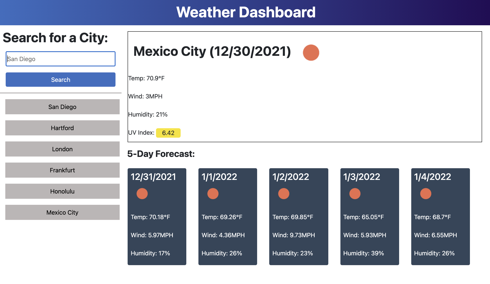

# WeatherDashboard

A weather dashboard page that uses the OpenWeatherMap API. The user searches for a city and is presented with both the current day's forecast as well as the next five days. 

## Description

- The user enters a search for the city they would like to see the weather for 
- The webpage presents the user with the ccurrent day's forecast for that city. Includes the temperature, wind speed, humidity, and a UV index which changes colors depending on what it is. Also gives the current date and an icon for the weather conditions
- The webpage presents the user with the next 5 days' forecast in smaller sized boxes, and includes all of the same information except for the UV index. 
- When the user searches for a city, that search is saved into a dynamically created button, allowing the user to search for that city again by clicking it. 

## Screenshots

## Links

-Link to [GitHub Repo](https://github.com/Zacharycampanelli/Weather_Dashboard)

-Link to [Deployed Webpage](https://zacharycampanelli.github.io/Weather_Dashboard/)

## Authors

Zachary Campanelli

[@zackcampanelli](https://www.linkedin.com/in/zackcampanelli/)
